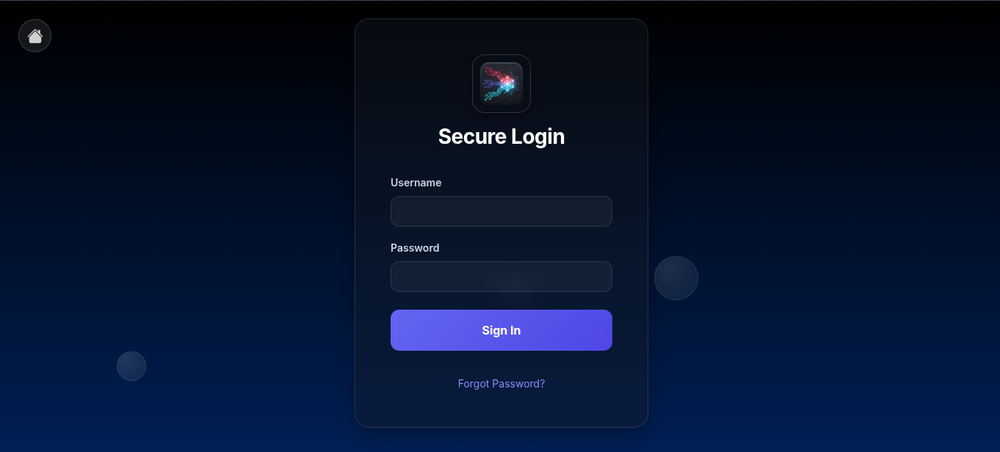
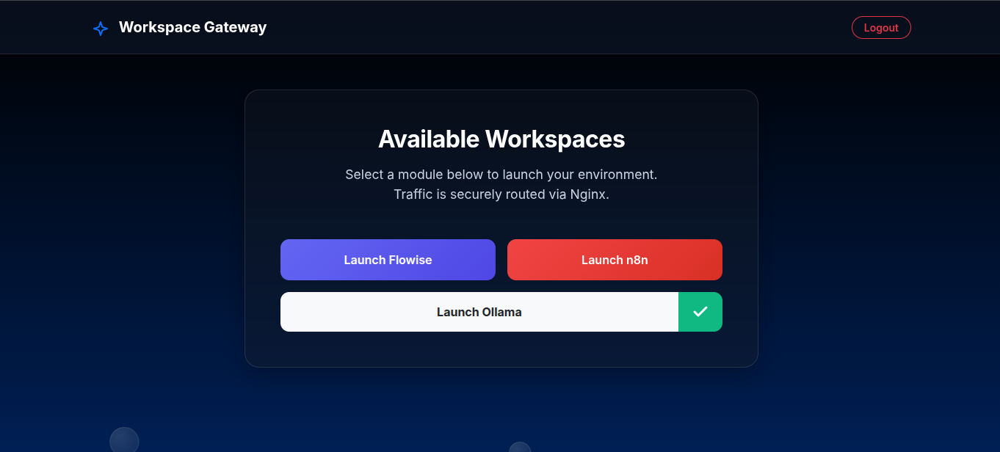

# AI Workspace SSO Gateway

## Overview
This repository contains the infrastructure and deployment architecture for a multi-tenant AI workspace. It utilizes a centralized a Python Flask backend to provide Single Sign-On (SSO) authentication across several containerized AI tools, including Flowise, n8n, and Ollama. 

Traffic is securely routed and authenticated via a custom Nginx reverse proxy using Docker Compose.

## Interface Preview

**Secure SSO Login**
<br>


<br><br>

**Workspace Gateway Dashboard**
<br>


## Tech Stack
*   **Reverse Proxy & Routing:** Nginx
*   **Authentication & Dashboard:** Python, Flask, PostgreSQL
*   **AI Infrastructure:** Flowise (Agent Builder), n8n (Automation), Ollama (Local LLMs)
*   **Containerization:** Docker, Docker Compose

## Key Features
*   **Subdomain SSO Authentication:** Nginx intercepts requests to protected subdomains (e.g., `flowise.*`, `n8n.*`, `ollama.*`) and verifies session validity against the Flask dashboard's `/internal-auth` endpoint before granting access.
*   **Optimized AI API Routing:** Unprotected API routes and WebSockets are configured to bypass authentication and buffering, enabling seamless streaming for LLM generation and webhook processing.
*   **Automated User Management:** The Flask admin panel supports bulk user creation via `.xlsx` Excel uploads, featuring automated formatting validation, duplicate prevention, and a 50-user rate limit with a 1-hour security lock.
*   **Secure Tunnels:** Integrated Cloudflare Tunnel (`cloudflared`) configuration for secure external network exposure without exposing local ports.

## Architecture 
1.  **Nginx (Port 80/443):** Acts as the entry point, handling SSL termination and global HTTP to HTTPS redirection.
2.  **Flask Dashboard (Port 5000):** Manages user sessions, password resets via SMTP OTPs, and admin controls. Runs via Gunicorn on a lightweight Python 3.12 image.
3.  **PostgreSQL (Port 5432):** Maintains persistent user data and session configurations on a dedicated Docker volume.

## Deployment

**Important Security Note:** Before deploying to production, ensure all sensitive variables (e.g., `POSTGRES_PASSWORD`, `SMTP_PASSWORD`, `TUNNEL_TOKEN`, and Supabase keys) are removed from the `docker-compose.yml` and managed securely via a `.env` file.

**1. Build and Start the Containers**
Ensure Docker and Docker Compose are installed on your Linux environment, then run:

```bash
docker-compose up -d --build
```
**2. Verify Services**
The Docker Compose file will spin up the `local-proxy`, `flask-dashboard`, `workspace-postgres`, and the associated AI tools within a bridged Docker network.

**3. Initial Setup**
Upon the first run, the Flask application context will automatically initialize the PostgreSQL database tables and generate a default admin account.